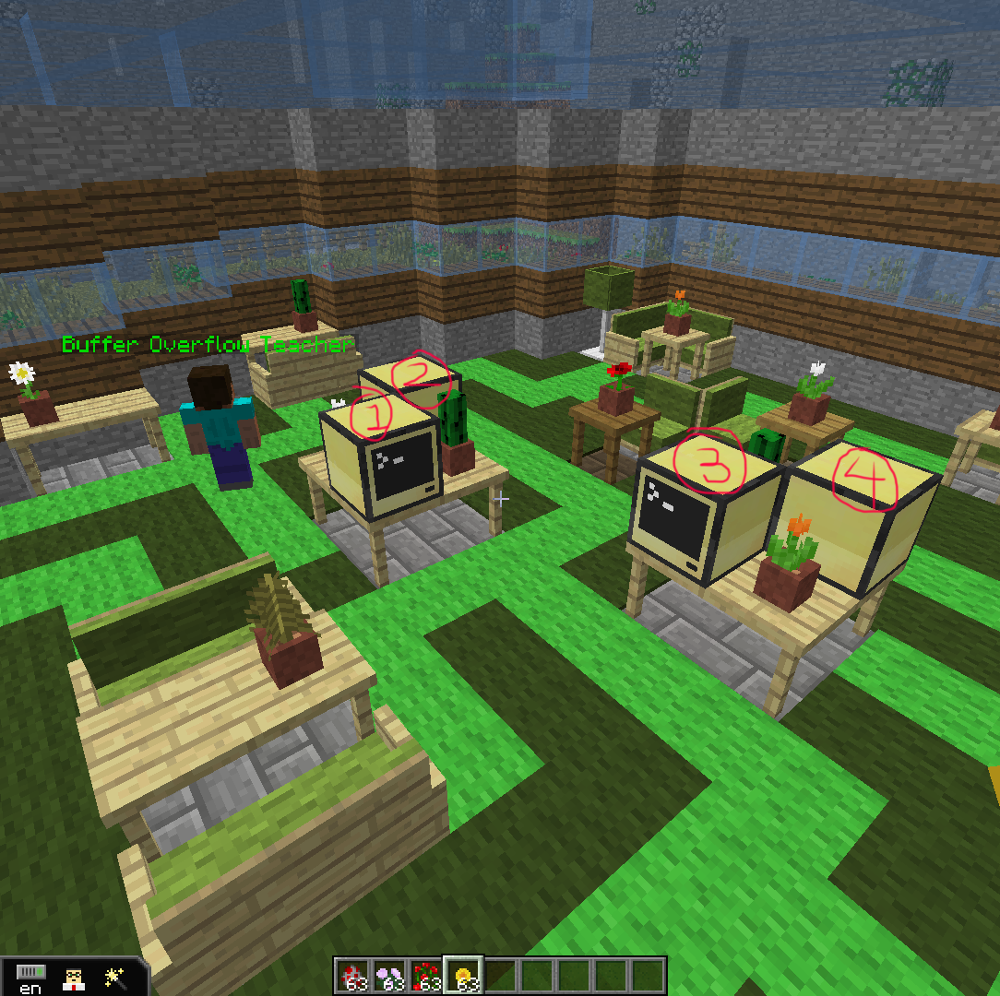
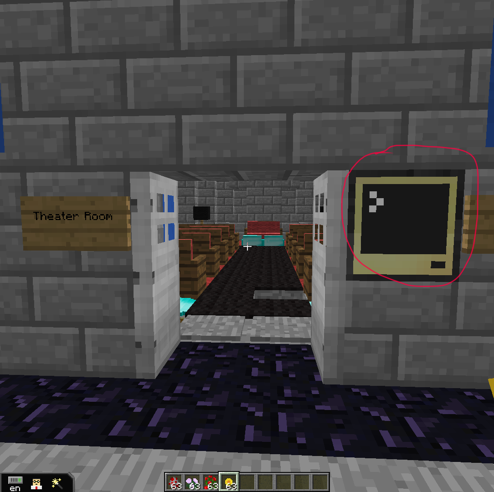

<!-- toc -->

- [Buffer Overflow](#buffer-overflow)
	- [Scripts used](#scripts-used)
	- [Step-By-Step Quest Setup](#step-by-step-quest-setup)
	- [Setup Buffer Overflow Script](#setup-buffer-overflow-script)
	- [Known Bugs](#known-bugs)

<!-- tocstop -->

## Buffer Overflow
### Scripts used
* pastebin  
  * tutorial building  
    http://pastebin.com/g1S6RK2x
  * main building  
    http://pastebin.com/UAXhn21N (Buffer Overflow on computer for main building)

* git repo  
  * [tutorial-buffer-overflow.lua](../../buffer-overflow/tutorial-buffer-overflow.lua)
  * [main-building-buffer-overflow.lua](../../buffer-overflow/main-building-buffer-overflow.lua)

### Step-By-Step Quest Setup
1. Create buffer overflow quest in global tab
2. Make quest complete dialog and set it to the NPC that the player must talk to in order to complete quest and set the availability to “When Active” and choose your quest

### Setup Buffer Overflow Script
* **tutorial building**  
Load the script onto the computers in the server with the `pastebin get g1S6RK2x startup` command and reboot computer by typing `reboot`.   
There are 4 computers in tutorial building.

* **main building**  
Load the script onto the computers in the server with the `pastebin get UAXhn21N startup` command and reboot computer by typing `reboot`.   
There is only one computer in the main building that needs to set up like shown below.  

* Place an Advanced Computer and type `pastebin get 27BkyWWu startup`.  
  * Modify the file questions and answers as needed.  
* Rename the file to `startup` and restart the computer or type `startup` to begin the program.

### Known Bugs
None
