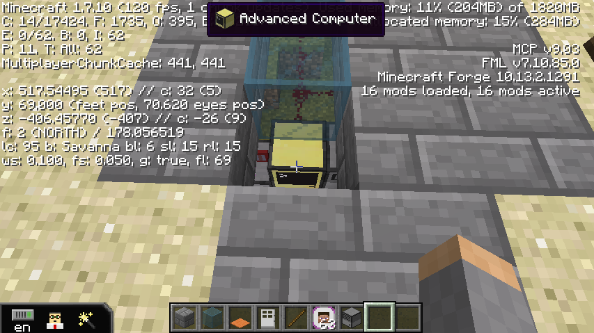

[Back to Menu](../../README.md)  

<!-- toc -->

- [Computers](#computers)
	- [Tutorial Building](#tutorial-building)
		- [Piggybacking door (outside)](#piggybacking-door-outside)
		- [Piggybacking room](#piggybacking-room)
		- [Brute Force room](#brute-force-room)
		- [Buffer Overflow room](#buffer-overflow-room)
		- [Snooping room](#snooping-room)
		- [Cryptography room](#cryptography-room)
		- [Man-In-The-Middle room](#man-in-the-middle-room)
	- [Main Building](#main-building)
		- [Piggyback door](#piggyback-door)
		- [Brute Force Room](#brute-force-room-1)
			- [Quest Computer](#quest-computer)
			- [Door](#door)
			- [Monitor](#monitor)
		- [Man-In-The-Middle room](#man-in-the-middle-room-1)
			- [Quest Computers](#quest-computers)
			- [Monitors](#monitors)
		- [Cafeteria](#cafeteria)
		- [Theater (Buffer Overflow)](#theater-buffer-overflow)
			- [Quest Computer](#quest-computer-1)
			- [Monitors](#monitors-1)
			- [Door](#door-1)
		- [Storage Room](#storage-room)
		- [Networking Room](#networking-room)
		- [Entrance](#entrance)
		- [Center Room](#center-room)

<!-- tocstop -->

# Computers
Right click at computers to boot

## Tutorial Building
### Piggybacking door (outside)

### Piggybacking room

### Brute Force room

### Buffer Overflow room

### Snooping room

### Cryptography room

### Man-In-The-Middle room

## Main Building
### Piggyback door

### Brute Force Room
#### Quest Computer

#### Door

#### Monitor
right click at the computer behind the monitor; no need to click monitor

### Man-In-The-Middle room
#### Quest Computers

#### Monitors
right click at the computer behind the monitor; no need to click monitor

### Cafeteria

### Theater (Buffer Overflow)
#### Quest Computer

#### Monitors

#### Door

### Storage Room

### Networking Room
All computer inside Networking Room are for questing.

### Entrance

### Center Room

