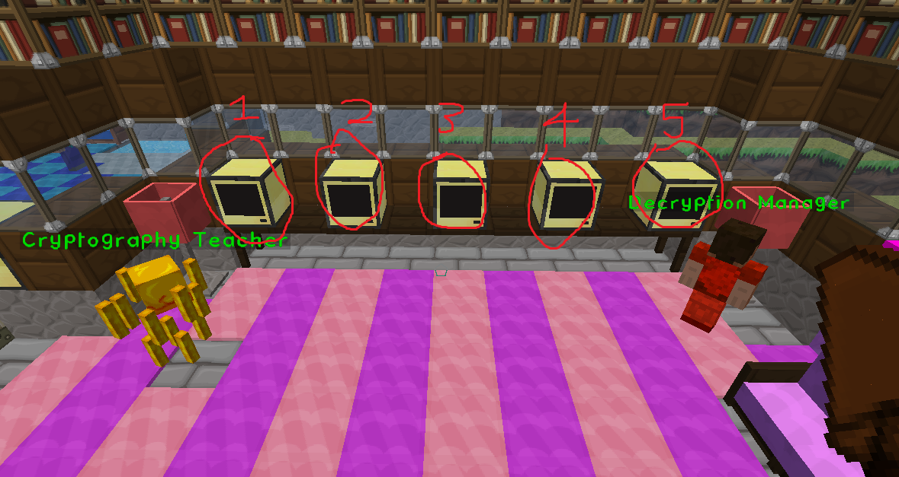
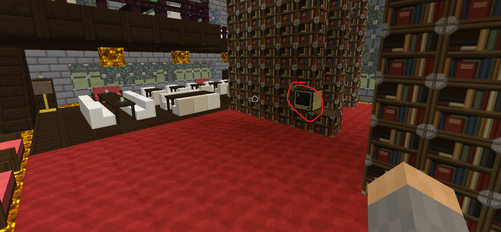

[Back to Menu](../../README.md)  

## Cryptography
### Scripts used
* pastebin  
http://pastebin.com/tEnE1kfC (password door)  
http://pastebin.com/YBdsz1jt  (Decription Computer)  
* github repo  
[decryption.lua](../../cryptography/decryption.lua)

### Step-By-Step Quest Setup
1. Create quest in global tab
2. Make quest complete dialog and set it to the NPC that the player must talk to in order to complete quest and set the availability to “When Active” and choose your quest.
3. Set the quest type to be dialog and select the dialog you just made.
4. Set the completion to be instant complete

### Step-By-Step NPC Setup
1. 2 NPCs are required for this.
2. Create the first NPC to give the mission and overview information. Create the necessary dialog and attach it to the NPC.
3. Create a second NPC with a dialog that gives the Encrypted Password and place him next to the Decryption computers.

### Setup Cryptography Script
1. **Tutorial Building**
  * Load the script onto the computers with the `pastebin get  YBdsz1jt startup` command and reboot the computer using the `reboot` command.  
  * There are five decryption computers in the Tutorial building.  
  
2. **Sudo Center**  
There is one computer in the sudo center located in the library. Uploaded the same way as before.

### Known Bugs
None
