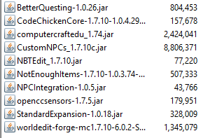

[Back to Menu](../../README.md)  
# Mod Setup
This documentation covers how to get mods and what to do with them. This does not cover how to get the MinecraftEdu initially setup, since that was provided to us when we started the server.

* Most mods can be found at [Curse website](http://minecraft.curseforge.com/mc-mods?filter-game-version=2020709689%3A367&filter-sort=popularity). In addition to browsing for mods on the [Curse website](http://minecraft.curseforge.com/mc-mods?filter-game-version=2020709689%3A367&filter-sort=popularity), you can also use a search engine to find other sites that have mods or better documentation on how to use a mod.    
 To do this, use the keywords “forge mod” to get the best results.

* Once you’ve found a mod you’d like to install, make sure to add it to the mods folder in both the server and your client.
  * Server Mods Folder: `minecraftedu\servertool\server\mods\1.7.10`
  * Client Mods Folder: `\minecraftedu\minecraft\mods\1.7.10`

* If you keep crashing or suspect there is some sort of error happening, you can check the logs for stack traces. Logs are located in `\minecraftedu\servertool\server\logs`. You will want to look at `latest.log` for any **[SEVERE]** or **[Server thread/SEVERE]** messages.

* At the end of this project, the Minecraft version we were using was Minecraft 1.7.10. As such, you should search for mods for that Minecraft version. Sometimes a mod will not work because the version of Forge that the server uses may be a bit older than the mod requires. If that happens, try looking for a slightly older version of that mod.

--- 

Here’s a list of mods that we’re currently using and their purpose:  

* [BetterQuesting](http://mods.curse.com/mc-mods/minecraft/238856-better-questing)
  - Allows you to create quests with NPCs

* [CodeChickenCore](http://chickenbones.net/Pages/links.html)
  - Library used by NotEnoughItems
  - Make sure you select 1.7.10 on the page, then click on CodeChickenCore button.

* **ComputerCraftEdu (comes with MinecraftEdu)**
  - Adds computers to the game.

* [CustomNPCs](http://www.kodevelopment.nl/minecraft/customnpcs)
  - Allows you to create NPCs to the game

* [NBTEdit](http://www.minecraftforum.net/forums/mapping-and-modding/minecraft-mods/1286750-in-game-nbtedit-edit-mob-spawners-attributes-in)
  - Allows you to easily modify meta data on any object you look at. This is useful for changing floppy disk IDs that are inside of chests.

* [NotEnoughItems](http://chickenbones.net/Pages/links.html)
  - Provides extra features when you open your inventory

* [NPCIntegration](http://minecraft.curseforge.com/projects/better-questing-npc-integration)
  - Integrates BetterQuesting with CustomNPCs

* [OpenCCSensors](http://www.computercraft.info/wiki/OpenCCSensors)
  - Adds sensors to the game

* [Standard Expansion](http://mods.curse.com/mc-mods/minecraft/238857-better-questing-standard-expansion)
  - Contains a handful of tasks, rewards, importers and themes to get you started using BetterQuesting.

* [World Edit](http://minecraft.curseforge.com/projects/worldedit)
  - Allows you to easily modify and build the world
