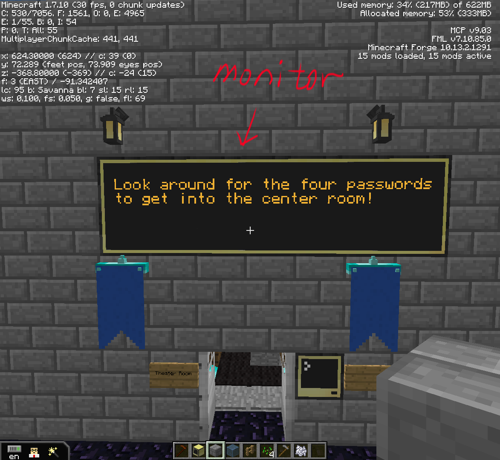
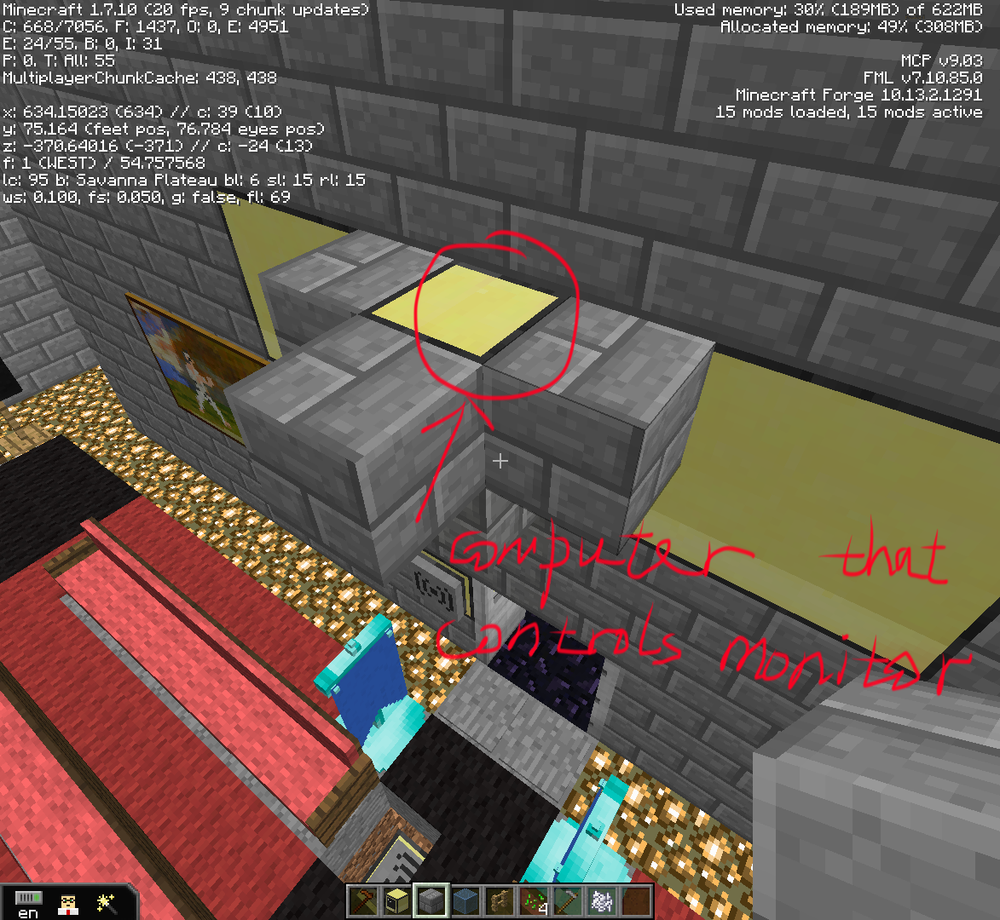

[Back to Menu](../../README.md)  
# Monitor Setup  
Each **monitor** has a **computer** that controls the display of that **monitor**.  
Usually, the computer that controls monitor are hidden behind the monitor.

**For example**



### Monitor Scripts:
monitor in center room of main building  
http://pastebin.com/2e0i7cb7  
monitor near the entrance that shows "Welcome kids", “Ready to Hack?”  
http://pastebin.com/8zsAkr6L  
Cafeteria (monitor that shows food menu)  
http://pastebin.com/1ueLgT0q  
4 Monitors that hints “Look around for the four passwords to get into the center room!”  
http://pastebin.com/PLikkMiV  

#### Setup

Run `pastebin get #hash startup` and then type `reboot` to restart the computer. (#hash is the last part of pastebin url)  
For example, `pastebin get PLikkMiV startup`


### Theater Big Screen Nyan Cat Script
theater Nyan Cat (the biggest screen)  
http://pastebin.com/Xe9gGj35  

#### Setup
1. Run `pastebin get Xe9gGj35 cat` to download file from pastebin and name in as `cat`.
2. Then create a file called `startup` under the same directory and write
```lua
		shell.run(“monitor”, “back”, “cat”)
```
Into “startup” file   

3. Reboot the computer

The four password monitor inside main building can be setup similar as the Nyan Cat monitor
