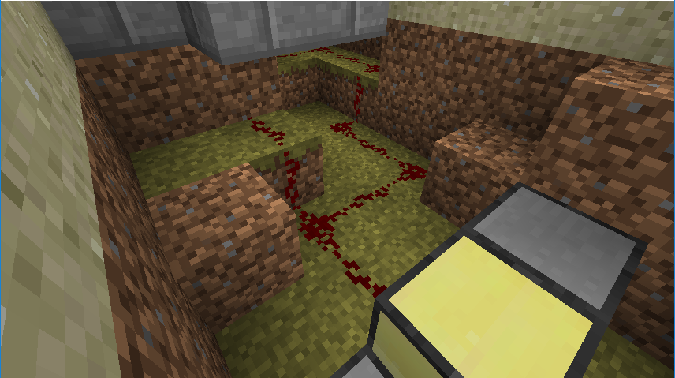
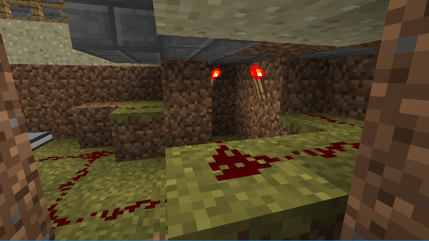
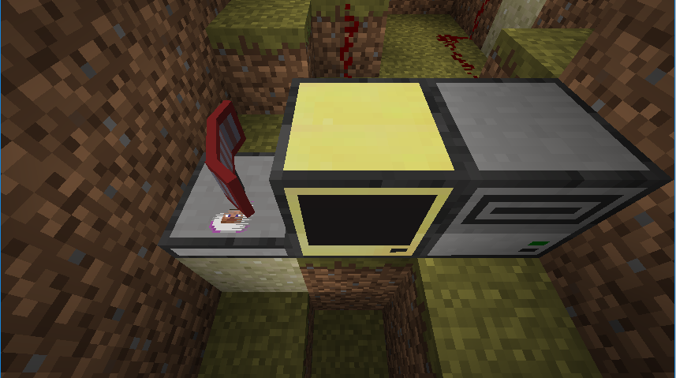

[Back to Developer Documentation Menu](../developer.md)  
## Piggybacking
### Script used
* pastebin
http://pastebin.com/E7bm3ajS

### Step-by-step Quset Setup
1. Look at the snooping documentation to learn how to set up a quest.  
  NPC Piggyback Step-By-Step:  
2. Create an NPC with the NPC wand  
3. Under the AI tab, click on “Edit” next to “Movement”. Make sure the following settings are set:  
  a. Moving type: Moving Path  
  b. Movement: Looping  
  c. The remaining options are up to you.  
4. Get an NPC pather and right click on the NPC. Then click on the floor to set waypoints (the closer the waypoints, the more defined path the NPC will take). Make sure you create waypoints up until the starting point (that means your last waypoint should be close to the first waypoint).  

### Computer Piggyback Step-by-Step
1. Start off by placing the door(s) you want.
2. Use redstone to connect the doors you’d like connect to a computer. The image below is an example of how we set it up.
   
   
The doors are located right above the redstone torches.
3. Connect the redstone wire to an Advanced Computer. Then place a Sensor to the left of the computer and a Disk Drive to the right. Place a Mk. IV card in the Sensor and a disk in the Disk Drive.
   
4. Open the Advanced Computer and type `pastebin get E7bm3ajS startup`  
Modify the code so that the offset on lines 16-18 is correct. To find the proper offset, first type `//wand` to get a wand.Then, while holding the wand, right click on the sensor and then right click the door. Subtract the door coordinates from the sensor coordinates to find the correct offset.
5. Create a file in the **disk** and call it `allowedNames`. Enter the names of the NPCs and Players you’d want to pass through the door, each on a new line.
6. Restart the computer or type `startup` to run the program.

### Known bugs
The NPC may sometimes get stuck. Make sure the NPC does not try to go through 1 width places, otherwise it may take the NPC a bit longer to get to the next waypoint.
