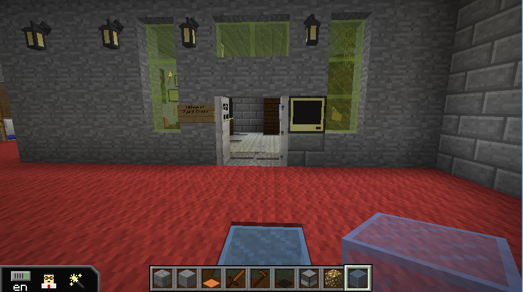
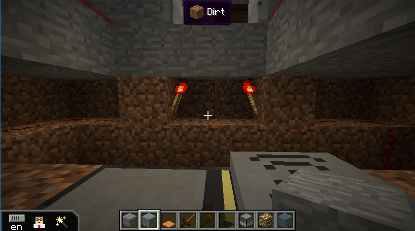
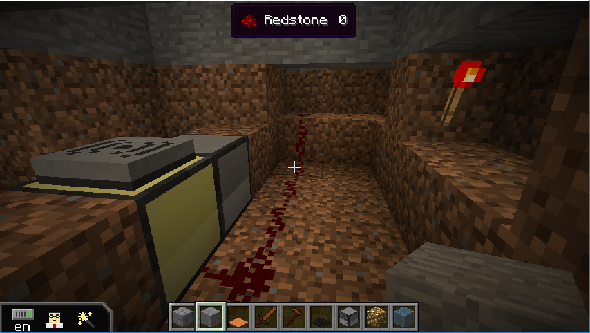
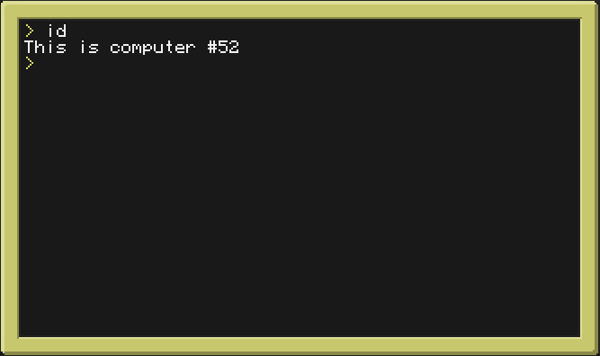
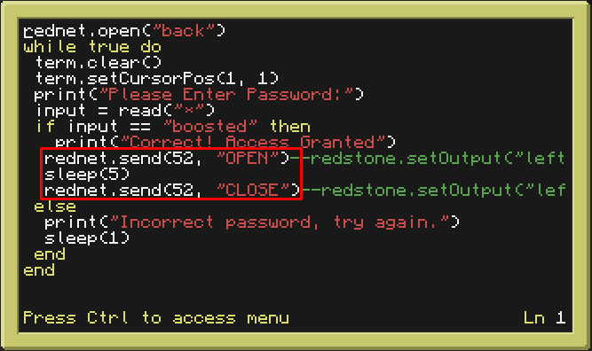

[Back to Menu](../../README.md)  

# Wireless Double Doors
This guide will show you how to have a single computer open double doors
We will be using this script (http://pastebin.com/JZ6DJ6L7) and modifying the program that opens the doors.

1. Wire your double doors to the computer and place a Modem on top of the computer that’s under ground. Here is an example wiring technique
  * a)   
  * b) 
2. Open the computer and type `pastebin put JZ6DJ6L7`
3. Then type `id` to get the computer's id.
  * a) 
4. Add a router to the back of the computer that the player will interact.
5. Add `rednet.open(id, “back”)` to the top of your code, then add the code selected in red in the appropriate spot to open the doors. Change the id from 52 to the corresponding id you found earlier.

